<h1 align="center">Hi 👋, I'm Pearl</h1>

<h3 align="center"><code>perkypearl@github ~ $ ./contributions.sh</code></h3>

<h3 align="center"><code>perkypearl@github ~ $ cat Skills.txt</code></h3>

<h3 align="center"><code>avi@github ~ $ ./links.sh</code></h3>

 